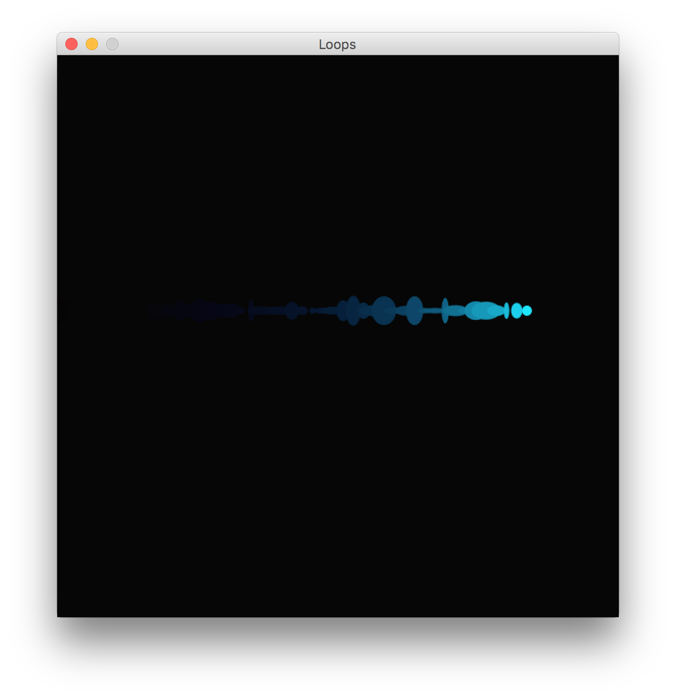
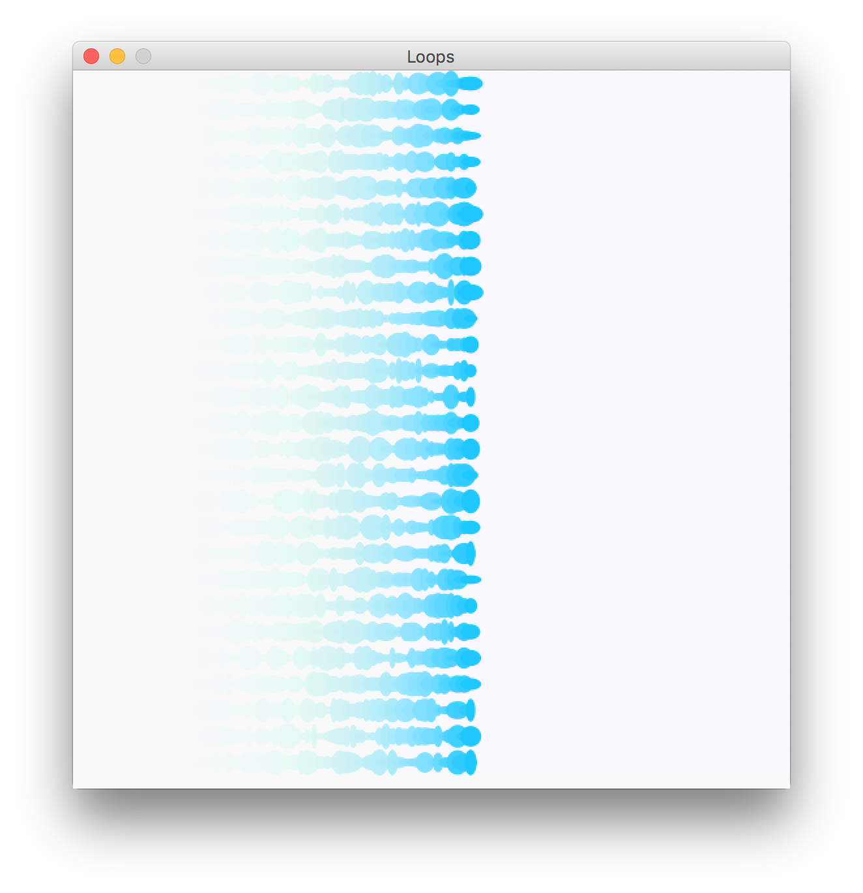

# Processing

Introduction to processing and programming

## Getting Started

Let's make awesome stuff! 

### Prerequisites

[Processing](https://processing.org/) and an inquisitive mind


### Installing

A step by step series of examples that tell you how to get a development env running

Say what the step will be

```
Give the example
```

# Exercise 1 

```
until finished
```

End with an example of getting some data out of the system or using it for a little demo

# Exercise 2

Explain how to run the automated tests for this system

### Break down into end to end tests

Explain what these tests test and why

```
Give an example
```




### And coding style tests

Explain what these tests test and why

```
Give an example
```

## Challenge for experts 

Add additional notes about how to deploy this on a live system

## Built With

* [Processing](https://processing.org/) - The web framework used

## Contributinga

Please read [CONTRIBUTING.md](https://gist.github.com/PurpleBooth/b24679402957c63ec426) for details on our code of conduct, and the process for submitting pull requests to us.

## Versioning

We use [SemVer](http://semver.org/) for versioning. For the versions available, see the [tags on this repository](https://github.com/your/project/tags). 

## Authors

* **Matthew Rollitt**

## License

This project is licensed under the MIT License - see the [LICENSE.md](LICENSE.md) file for details

## Acknowledgments

* Hat tip to anyone whose code was used
* Inspiration
* etc
